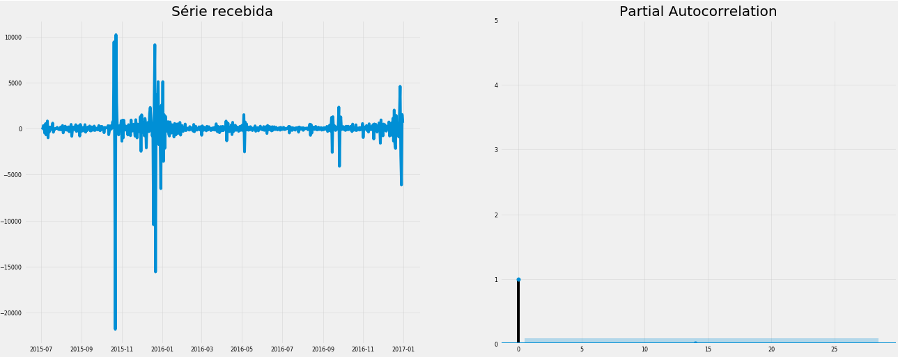

# Web Traffic Prediction

Esse é um projeto simples de análise de séries temporais aplicadas a web analytics. Nesse projeto vou cobrir os seguintes pontos do processo de ciência de dados:


Ou seja, utilizando dados já coletados irei entende-los, prepara-los e ao final criarei e avaliarei alguns modelos para solução do problema.

# O problema

#### "Podemos prever a quantidade de acessos a uma página da wikipedia?"

Esse problema foi apresentado pela equipe da Google no [Kaggle](https://www.kaggle.com/c/web-traffic-time-series-forecasting/data) em 2017. O principal objetivo aqui é prever a quantidade de acessos a uma página do wikipedia levando em consideração somente a sua série temporal de acessos. Entender e prever com assertividade a quantidade de acessos a uma determinada página é importante para vários níveis de um negócio, a equipe de TI pode provisionar mais recursos de infra-estrutura para aguentar uma alta demanda de acessos, times de marketing podem se planejar para retirar valor de uma grande quantidade de acessos ou tomar ações para que o tráfego a página não caia.

# As ferramentas

Essas foram as bibliotecas utilizadas para executar o projeto.

```python
## utils
import pandas as pd
import numpy as np

## imports para análise
import statsmodels.api as sm
from statsmodels.tsa.stattools import adfuller
from statsmodels.graphics.tsaplots import plot_acf
from statsmodels.graphics.tsaplots import plot_pacf

## imports para modelagem
from fbprophet import Prophet
from sklearn.metrics import mean_squared_error,mean_absolute_error
import numpy as np
import math

## Imports para os gráficos
import matplotlib.pyplot as plt
import matplotlib as mat
from pylab import rcParams

plt.style.use('fivethirtyeight')
mat.rcParams['axes.labelsize'] = 10
mat.rcParams['xtick.labelsize'] = 8
mat.rcParams['ytick.labelsize'] = 8
mat.rcParams['grid.alpha'] = 0.4
mat.rcParams['text.color'] = 'k'
rcParams['figure.figsize'] = 16,6
```

# Os dados

O arquivo 'train_1.csv' possui mais de 145 mil entradas e cada uma delas representa os dados de acesso de uma página e cada umas das 551 colunas representa um dia. Por isso montei um função simples para selecionar somente algumas linhas do dataset, trata-las e retornar um dataframe.

```python

def load_data(list_of_rows):
    """ Lê o arquivo csv de treino e retorna um dataframe contendo somente as linhas especificadas em list_of_rows """

    df = (
        pd.read_csv('../data/train_1.csv')
        .iloc[list_of_rows,:]
        .assign(Page = lambda x: x.Page.str.split('.wikipedia.',expand=True))
        .rename(columns={'Page':'data'})
        .set_index('data')
        .transpose()

        )

    df.columns = [x.casefold() for x in df.columns]

    return df

```
Executarei o trabalho somente para três páginas ([Capitão América](https://en.wikipedia.org/wiki/Captain_America), [O Império Contra Ataca](https://en.wikipedia.org/wiki/The_Empire_Strikes_Back) e [Albert Camus](https://fr.wikipedia.org/wiki/Albert_Camus)).

```python

df = load_data([39867,11977,4365])
df.index = pd.to_datetime(df.index,format = '%Y-%m-%d')
df.head()

```


# Análise Exploratória

Iniciando a análise percebo que não há nenhum valor nulo, algo que facilita bastante o trabalho.

```python

df.isna().sum()

```


Uma série temporal pode ser decomposta e isso significa extrair componentes que juntos remontam nossa série. Para demonstrar esse conceito vou usar o [sm.tsa.seasonal_decompose](https://www.statsmodels.org/stable/generated/statsmodels.tsa.seasonal.seasonal_decompose.html) junto com uma funão para criar um plot.

```python

def decompose_serie(serie):
    """ Recebe uma série e plota a sua decomposição nos componentes de uma série temporal """

    ## multiplicativa
    mult = sm.tsa.seasonal_decompose(serie, model='multiplicative',extrapolate_trend='freq')
    
    # plotando
    plt.rcParams.update({'figure.figsize': (20,8)})
    mult.plot()#.suptitle("Decompisição Mutiplicativa", fontsize=22)
    plt.show()
    
    return mult.resid

```

Como utilizei um método de decomposição multiplicativo temos o seguinte:

> y(t) = tendência(t) * sazonalidade(t) * resíduo(t)

O que significa que a qualquer tempo t é possível encontrar o seu valor de Y apenas multiplcando seus componentes. Vamos testar esse conceito utilizando os dados de capitão américa como teste.

```python

## decompondo
teste = sm.tsa.seasonal_decompose(df.captain_america_en, model='multiplicative',extrapolate_trend='freq')

## salvando os componentes
resid = teste.resid
season = teste.seasonal
trend = teste.trend

## criando o dataframe
teste_df = pd.DataFrame([resid,season,trend]).transpose().assign(total = lambda x: x.resid * x.seasonal * x.trend).assign(valores_reais = df.captain_america_en)
teste_df

```


Pronto! Agora sei (e você também) que sazonalidade e tendência são componentes de uma série temporal e que isso pode ser medido e quantificado!


Vamos verificar a decomposição de cada uma das as nossas séries.

```python

resid_cap = decompose_serie(df.captain_america_en)

```


```python

resid_empire = decompose_serie(df.the_empire_strikes_back_en)

```


```python

resid_albert = decompose_serie(df.albert_camus_fr)

```


Em cada uma das séries decompostas o primeiro gŕafico representa os valores observados, o segundo a tendência, o terceiro a sazonalidade e o quarto o resíduo. Ẽ interessante notar que os resíduos de capitão américa e império contra ataca tem valores não tão centralizados, o que significa que não podemos confiar somente na sazonalidade e na tendência para prever os valores no gráfico inicial.

Isso fica claro quando voltamos para teste_df.

```python

teste_df[(teste_df.resid > 0.999) & (teste_df.resid < 1.0)]

```


```python

5522.285714 * 0.940249 = 5192.3236203027855

```

Para valores de resíduos próximos a 1 dependemos fortemente da sazonalidade e tendência para chegar no valor real. Ou seja, a variação nos resíduos da série de cada site pode ser algo interessante a ser analisado.

```python

f, axes = plt.subplots(1,3)
plt.suptitle('Plot resíduos',y=0.95)

axes[0].boxplot(resid_cap,notch=True)
axes[1].boxplot(resid_empire,notch=True)
axes[2].boxplot(resid_albert,notch=True)

plt.show()

```


Das três séries a mais próxima a 1 é da página de Albert Camus. O resíduo não é modelável, ele ocorre de forma aleatória. Logo é seguro dizer que nas duas primeiras séries (Capitão América e O Império Contra Ataca) os modelos errarão mais e na última série (Albert Camus) nosso modelos acertarão mais.


# Modelagem - Facebook Prophet

O [Prophet](https://facebook.github.io/prophet/) é uma ferramenta open-source criada pela equipe de [ciência de dados](https://research.fb.com/category/data-science/) do Facebook. A ferramenta foi construída para lidar com séries temporais e é bastante robusta.

## Data Prep

O Prophet obriga que nossa série temporal esteja exatamente da forma abaixo.


Para isso basta utilizar o pandas, na função abaixo:

1. Colhe os dados
2. Trata os dados
3. Divide em treino e teste
4. Cria o modelo
5. Treina o modelo 
6. Executa uma predição com os dados de treino
7. Executa uma predição com os dados de test
8. Plota os gráficos para avaliação
9. Avalia o modelo utilizando RMSE e MAE.

Obs.: Sei que em termos de engenharia seria melhor ter criado uma classe que executa as funções acima, mas por razões de prazo escolhi fazer dessa forma.


```python

def prophet_val(page):
    
    ## 1 e 2 seleciona os dados a serem usados e os trata
    if page == 'captain':
        data = pd.DataFrame(df.captain_america_en).reset_index().rename(columns = {'index':'ds','captain_america_en':'y'})
        plt.title('Capitão América')
    elif page == 'empire':
        data = pd.DataFrame(df.the_empire_strikes_back_en).reset_index().rename(columns = {'index':'ds','the_empire_strikes_back_en':'y'})
        plt.title('O Império Contra Ataca')
    elif page == 'albert':
        data = pd.DataFrame(df.albert_camus_fr).reset_index().rename(columns = {'index':'ds','albert_camus_fr':'y'})
        plt.title('Albert Camus')
        
    ## 3. dividindo em treino e teste
    data_train = data[:-100]
    data_test = data[-100:]

    ## 4. criando o modelo
    m = Prophet(daily_seasonality=True,yearly_seasonality=True,seasonality_mode='multiplicative')

    ## 5. treinando o modelo
    m.fit(data_train)

    ## 6. prevendo em treino
    train_pred = m.predict(pd.DataFrame(data_train.ds))['yhat'].values

    ## 7. prevendo em teste
    test_pred = m.predict(pd.DataFrame(data_test.ds))['yhat'].values
             
    ## 8. plotando
    plt.plot(data.y,label='Valor original')
    plt.plot(train_pred,label = 'Valor de treino predito')

    test_pred_plot = [np.nan for _ in range(train_pred.shape[0])]
    for value in test_pred:
        test_pred_plot.append(value)

    plt.plot(test_pred_plot,label = 'Valor de teste predito')
    plt.legend()
    plt.show()

    ## 9. avaliando
    print('## Avaliando o modelo ## \n')
    print(f'Root mean squared error      : {math.sqrt(mean_squared_error(data_test.y,test_pred))}')
    print(f'Mean absolute error          : {mean_absolute_error(data_test.y,test_pred)}')

```

Executando a função acima para cada uma das séries temos o seguinte:

```python

prophet_val('captain')

```


```python

prophet_val('empire')

```


```python

prophet_val('albert')

```


# Modelagem - ARIMA

[ARIMA](https://en.wikipedia.org/wiki/Autoregressive_integrated_moving_average) é a técnica mais comum para análise de séries temporais. ARIMA significa 'auto regressive integrated moving avarage' e é um tipo de modelo que para prever o valor de hoje ele utiliza os valores de uma janela anterior (chamada de lag). Se analisarmos os lags e encontrarmos o que chamamos de autocorrelação significa que podemos utilizar os valores dos lags prever valores futuros.

Um modelo ARIMA é caracterizado por três termos (p,d,q):

> p é a ordem do termo AR(autoregressive);

> q é a ordem do termo MA(moving avarage);

> d é o número de diferenciações que temos que fazer para tornar uma série estacionária.

Mas o que significa uma série estacionária? Vamos testar nossas séries para essa característica.

O ARIMA pede para que nossos dados sejam estacionários, existem testes para definir se uma série é ou não estácionária, nesse trabalho utilizaremos o teste [Adfuller](Augmented Dickey-Fuller). Ser uma série [estacionária](https://en.wikipedia.org/wiki/Stationary_process) significa que andando no eixo do tempo ela não muda seus valores de média e variância.

```python

def test_stationary(serie,janela=30):
    
    """ Recebe uma série plota suas estatíticas móveis, executa o teste adfuller e printa uma conclusão """
    
    ## plotando as médias e variâncias dentro de uma determinada janela
    rolmean = serie.rolling(window = janela).mean()
    rolstd = serie.rolling(window = janela).std()
    
    # Plot das estatísticas móveis
    orig = plt.plot(serie, color = 'blue', label = 'Original')
    mean = plt.plot(rolmean, color = 'red', label = 'Média móvel')
    std = plt.plot(rolstd, color = 'black', label = 'Desvio padrão')
    plt.legend(loc = 'best')
    plt.title("Estatísticas Móveis - Média e Devio Padrão",size=12)
    plt.show()
    
    # Teste Dickey-Fuller
    print("\nResultado do Teste Dickey-Fuller:\n")
    dfteste = adfuller(serie, autolag = 'AIC')
    
    # Formatando a saída
    dfsaida = pd.Series(dfteste[0:4], index = ['Estatítisca do Teste',
                                               'Valor-p',
                                               'Numero de lags consideradas',
                                               'Número de observações usada'])
    
    # Loop por cada item de saída do teste
    for key, value in dfteste[4].items():
        dfsaida["valor Crítico (%s)"%key] = value
        
    # print
    print(dfsaida)
    
    # Testa o valor-p
    print ('\nConclusão:')
    if dfsaida[1] > 0.05:
        print('\nO valor-p é maior que 0.05 e, portanto, não temos evidências para rejeitar a hipótese nula.')
        print('Essa série provavelmente não é estacionária.')
    else:
        print('\nO valor-p é menor que 0.05 e, portanto, temos evidências para rejeitar a hipótese nula.')
        print('Essa série provavelmente é estacionária.')  

```

Utilizando a função acima para todas a nossas séries,

```python
test_stationary(df.captain_america_en)
```


```python
test_stationary(df.the_empire_strikes_back_en)
```


```python
test_stationary(df.albert_camus_fr)
```


Fazendo a análise acima chegamos a conclusão que deveremos efetuar uma transformação em Capitão América para deixar a série estacionária. Iremos efetuar uma transformação por diferenciamento e o grau desse diferenciamento será colocado no nosso modelo ARIMA. 


d == grau do diferenciamento

ARIMA(order = (p,q,d))

Para isso basta analisar os plots de autocorrelação. Vamos verificar como ficam os plots de autocorrelação com diferenciamento de grau 1 e de grau 2.

```python
data = df.captain_america_en

f, axes = plt.subplots(3, 2,figsize=(18,15))

axes[0,0].plot(data)
plot_acf(data,ax=axes[0,1]);
axes[0,0].set_title('Original')

axes[1,0].plot(data.diff())
plot_acf(data.diff().dropna(),ax=axes[1,1]);
axes[1,0].set_title('Diferenciação de 1o grau')

axes[2,0].plot(data.diff().diff())
plot_acf(data.diff().diff().dropna(),ax=axes[2,1]);
axes[2,0].set_title('Diferenciação de 2o grau')

```


Visto que existe uma queda na autocorrelação em ambos os graus de diferenciamento vale a pena testar o modelo ARIMA para os dois graus. Então lá na frante vamos testar somente para capitão américa:

ARIMA(order = (p,1,q));

ARIMA(order = (p,2,q));

As séries estacionárias não serão alteradas, ou seja, d == 0. Agora temos que descorbrir o melhor valor de p, para isso basta analisarmos o gráfico de autocorrelação parcial.

```python
def make_pacf_plot(serie):
            
    fig, axes = plt.subplots(1, 2)

    axes[0].plot(serie); 
    axes[0].set_title('Série recebida')

    axes[1].set(ylim=(0,5))
    plot_pacf(serie, ax=axes[1]);

    plt.show()

```
Podemos considerar p como a quantidade de correlações parciais que ultrapassam a área azul do gráfico (limite de significância).

```python
make_pacf_plot(df.the_empire_strikes_back_en.diff().dropna())
make_pacf_plot(df.the_empire_strikes_back_en.diff().diff().dropna())
```



```python
make_pacf_plot(df.the_empire_strikes_back_en)
```


```python
make_pacf_plot(df.albert_camus_fr)
```


Vamos atualizar nosso valores para o ARIMA:

>Capitão América <br> ARIMA(order = (2,1,q)) <br>  ARIMA(order = (0,2,q))

> O império contra ataca <br>  ARIMA(order = (3,0,q));

> Albert Camus <br>  ARIMA(order = (6,0,q));

Nessa análise vamos deixar o valor de q descricionário e testaremos para vários. Vamos finalmente criar nossos modelos ARIMA utilizando o código abaixo.

```python  
def forecast_accuracy(forecast, actual):
    mape = np.mean(np.abs(forecast - actual)/np.abs(actual))  # MAPE
    mae = np.mean(np.abs(forecast - actual))    # MAE
    rmse = np.mean((forecast - actual)**2)**.5  # RMSE
    return({'mape':mape,'mae': mae,'rmse':rmse})


def arima_modelling(serie,order,alpha=0.05):
    
    train = serie[:-100]
    test = serie[-100:]
    
    model = ARIMA(train, order=order)
    fitted = model.fit(disp=-1)
       
    # Forecast
    fc, se, conf = fitted.forecast(100, alpha=0.05)  # 60% conf

    # Make as pandas series
    fc_series = pd.Series(fc, index=test.index)
    lower_series = pd.Series(conf[:, 0], index=test.index)
    upper_series = pd.Series(conf[:, 1], index=test.index)

    # Plot
    plt.plot(train, label='treino')
    plt.plot(test, label='test')
    plt.plot(fc_series, label='forecast')
    plt.fill_between(lower_series.index, lower_series, upper_series, color='k', alpha=.15)
    plt.title('Forecast vs Real')
    plt.legend(loc='upper left', fontsize=8)
    plt.show()
    
    print(forecast_accuracy(fc,test))
```

## ARIMA - Capitão América

```python  
arima_modelling(df.captain_america_en,order=(2,1,0))
```


```python  
arima_modelling(df.captain_america_en,order=(2,1,1))
```


```python  
arima_modelling(df.captain_america_en,order=(2,1,2))
```


```python  
arima_modelling(df.captain_america_en,order=(0,2,1))
```


## ARIMA - O Império Contra Ataca

```python  
arima_modelling(df.the_empire_strikes_back_en,order=(3,0,0))
```


## ARIMA - Albert Camus

```python  
arima_modelling(df.albert_camus_fr,order=(6,0,0))
```


# Avaliação e Conclusão

O Facebook demonstra bons resultados, porém para compararmos melhor com o ARIMA podemos alterar alguns parâmetros. Em uma situação de solução rápida de entrega provavelmente escolheria o Prophet. Com mais tempo provavelmente vale a pena aplicar alguma técnica de deep learning, mais especificamente redes neurais recorrentes.

Espero que você tenha gostado dessa pequena análise e esteja, agora, sabendo um pouco mais sobre séries temporais.